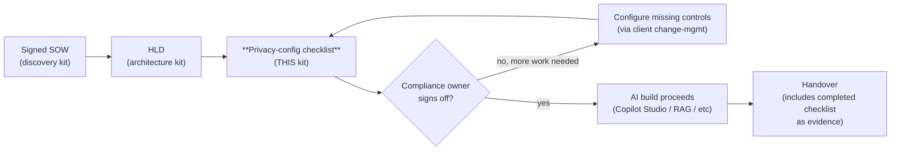
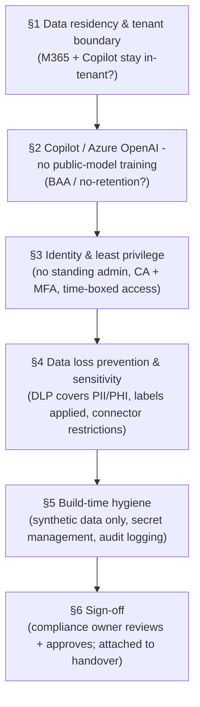
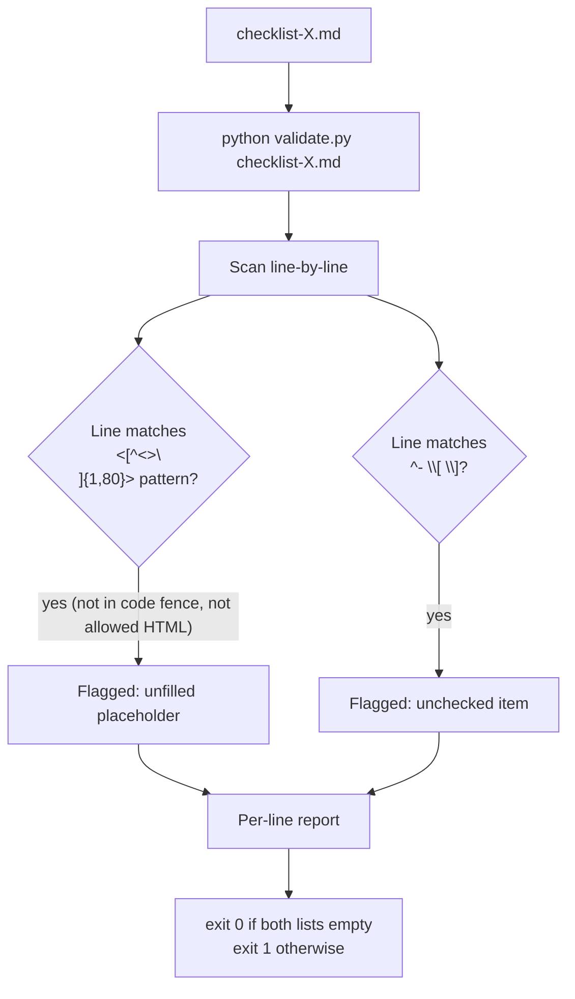
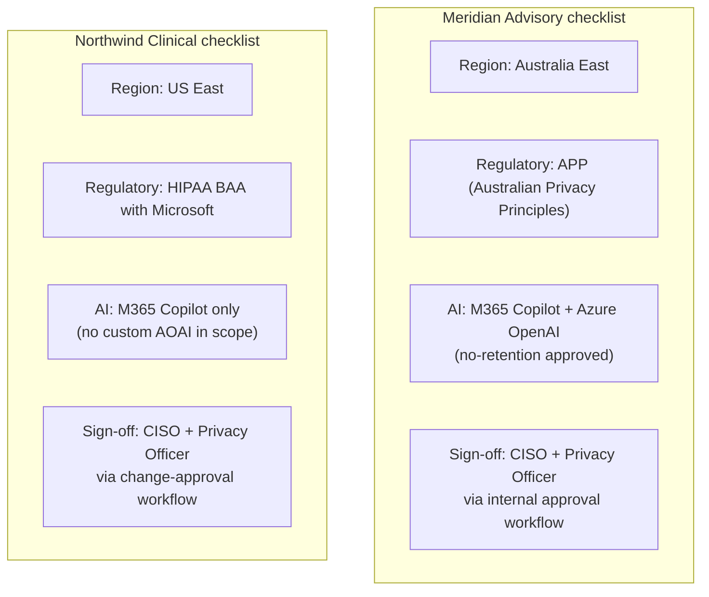

# Diagrams

This is a templates kit — the diagrams here are about how the privacy-
config checklist fits into an engagement, not about a runnable system.

## 1. Where the privacy-config runs in the engagement lifecycle

The checklist gates the AI build. If §6 (sign-off) doesn't get signed,
the build doesn't start. Regulated clients require this; even
unregulated ones benefit from it as a procurement-readiness signal.

## 2. Checklist structure — six concerns, in order

The ordering matches the buyer's mental model: "where does our data
go?" → "is it used to train someone else's model?" → "who can access
it?" → "what stops it leaking?" → "how was the build itself safe?" →
"who signed off?"

## 3. Validator behaviour — placeholder + checkbox modes

Unlike the other template kits' validators (placeholder only), this one
ALSO flags unchecked items — because a checklist with an `- [ ]` item is
by definition incomplete, regardless of placeholders.

## 4. Two worked checklists — different regulatory contexts

Same checklist structure; different evidence emphases (data residency,
which BAA, which regulatory regime, where the no-retention commitment
lives). The kit is region- and industry-agnostic by design.
